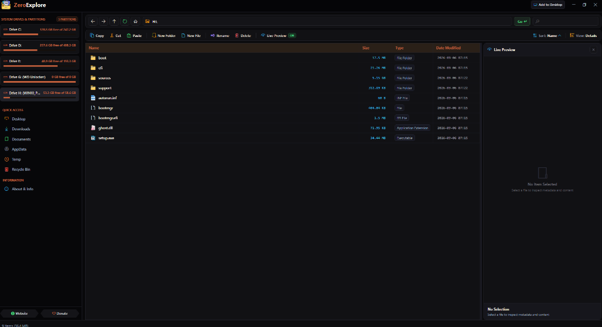
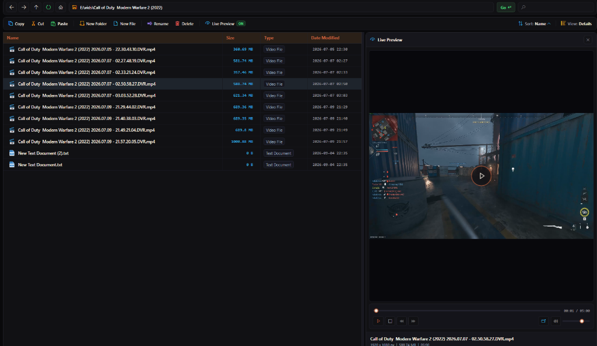
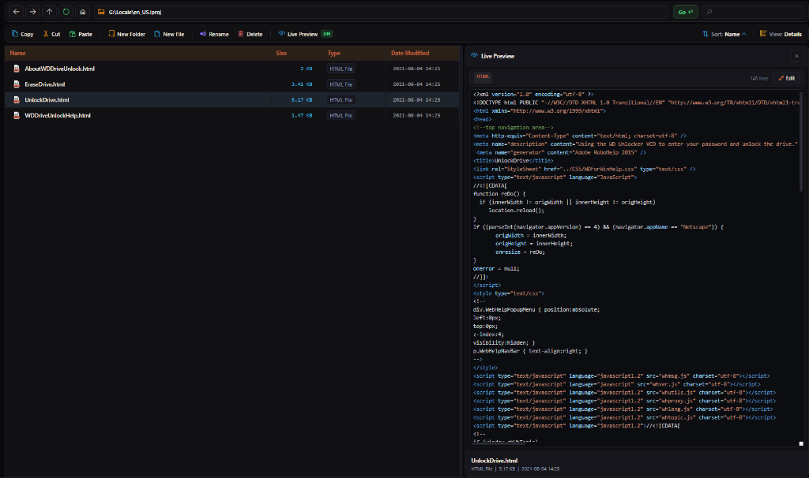
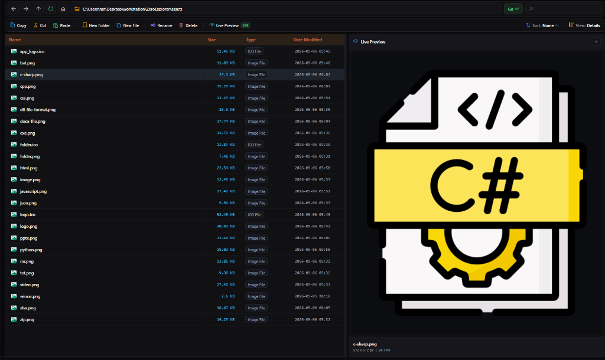

<p align="center">
  <a href="https://zeroiq.site/" target="_blank">
    
  </a>
</p>

<h1 align="center">ZeroExplorer</h1>

<p align="center">
  <strong>Fast, Safe & Intelligent Windows 10 / 11 File Explorer</strong><br>
  <em>Hyprland Tiling Dual-Pane • Multi-Tab Workspaces • Non-Blocking C# Engine • Live Folder Size Calculator • Rich Media & Code Previewer • Built-in WinRAR & 7-Zip Suite • Batch Multi-Renamer • Hash Checksums</em>
</p>

<p align="center">
  
  
  
  
  
  <a href="https://zeroiq.site/donate" target="_blank"></a>
</p>

---

## 🚀 Quick Launch (1-Line Command)

Open **PowerShell as Administrator** and run:

```powershell
irm https://raw.githubusercontent.com/ZeroIQs/ZeroExplorer/main/run.ps1 | iex
```

*Or simply double-click **`ZeroExplore.bat`** or **`ZeroExplore.vbs`** in the repository.*

---

## 📸 Screenshots

<p align="center">
  
</p>

<p align="center">
  
</p>

<p align="center">
  
</p>

<p align="center">
  
</p>

---

## 🌟 What ZeroExplorer Does

| Module | What It Does |
| :--- | :--- |
| 🪟 **Multi-Tab Workstations** | Full multi-tab explorer with tab duplicate, middle-click to close, persistent navigation history per tab, and lightning-fast tab switching. |
| ⚡ **Hyprland Dynamic Tiling Mode** | 1-click dual-pane split workstation mode inspired by modern tiling window managers. Browse, compare, and transfer files side-by-side with independent controllers. |
| 🚀 **High-Performance C# Engine** | Embedded native C# core (`ZeroExplore.FileExplorerEngine`) with multi-threaded asynchronous I/O, parallel directory traversal, and zero UI stuttering. |
| 📊 **Live Folder Size Calculator** | Multi-threaded background folder size computation that calculates real directory sizes without freezing the interface, with live size sorting. |
| 👁️ **Rich Preview & Inspector Pane** | Instant sidebar preview for images, video & audio playback with interactive seek/volume controls, rich syntax-highlighted code (`.cs`, `.py`, `.js`, `.json`, `.cpp`, `.ps1`, `.html`, `.css`), markdown, and text. |
| 🔐 **File Checksum & Hash Generator** | Real-time hash calculation (MD5, SHA1, SHA256) directly in the preview pane for rapid file integrity and security verification. |
| 📦 **Authentic WinRAR & 7-Zip Suite** | Deep integration with WinRAR and 7-Zip featuring authentic icons and context menu actions (*Extract Here*, *Extract to Subfolder*, *Extract Interactive Dialog*, *Add to Archive*). |
| 🏷️ **Smart Batch Multi-Renamer** | Advanced batch renaming engine supporting prefix, suffix, string replacement, index sequence numbering, and custom regex transformations across hundreds of files in seconds. |
| 🔍 **Omni Search & Breadcrumb Bar** | Instant fuzzy search filter with live sub-item matching, coupled with an interactive breadcrumb address bar for frictionless directory jumping. |
| 🎨 **Dark Obsidian Fluent Design** | Sleek frameless `WindowChrome` UI with chamfered hexagonal badges, scalloped plaque buttons, smooth scroll physics, and responsive hover micro-interactions. |
| 💾 **Live Drive & Storage Meters** | Real-time visual disk capacity bars (Used vs. Free space) for all fixed, removable, and network drives. |
| ⚡ **Power User Action Hub** | 1-click shortcuts: Open in Windows Terminal, PowerShell, CMD, Git Bash, or VS Code; Copy Full/Relative Path; Edit Attributes (Hidden, Read-Only, System); and Shell Native Properties. |

---

## 🔒 Safety & Performance Highlights

- 🛡️ **100% Safe & Non-Destructive**: Standard Windows Shell API operations ensure native Recycle Bin support, safe file locks, and zero data corruption.
- ⚡ **Non-Blocking Multi-Threaded Engine**: Heavy operations (thumbnails, folder sizes, directory scans, searches) run in asynchronous C# background threads.
- 🌍 **100% Portable & Zero Install**: No installer required, no registry pollution, no hardcoded machine paths — runs cleanly from any folder, drive, or USB flash drive.
- ✈️ **100% Offline & Private**: Zero analytics, zero telemetric tracking, zero external network requests during file operations.
- 🔧 **PowerShell 5.1 & 7 Compatible**: Seamlessly runs on standard Windows 10/11 PowerShell as well as modern PowerShell 7+ (Core) with automatic STA thread handling.
- 🎨 **Modern DPI-Aware UI**: Clean dark aesthetic designed for high-resolution 1080p, 2K, and 4K displays with high contrast legibility.

---

## 💖 Support & Donate

If you find **ZeroExplorer** helpful and want to support ongoing updates and future tools in the Zero ecosystem, consider buying a coffee or donating to the project!

<p align="center">
  <a href="https://zeroiq.site/donate" target="_blank">
    
  </a>
</p>

---

## 👨‍💻 Author & Contact

- **Website:** <a href="https://zeroiq.site/" target="_blank" rel="noopener noreferrer">zeroiq.site</a>
- **Donate:** <a href="https://zeroiq.site/donate" target="_blank" rel="noopener noreferrer">zeroiq.site/donate</a>
- **GitHub:** <a href="https://github.com/ZeroIQs" target="_blank" rel="noopener noreferrer">@ZeroIQs</a>
- **Created by:** Amir Ali
- **License:** [GNU GPLv3](LICENSE)
